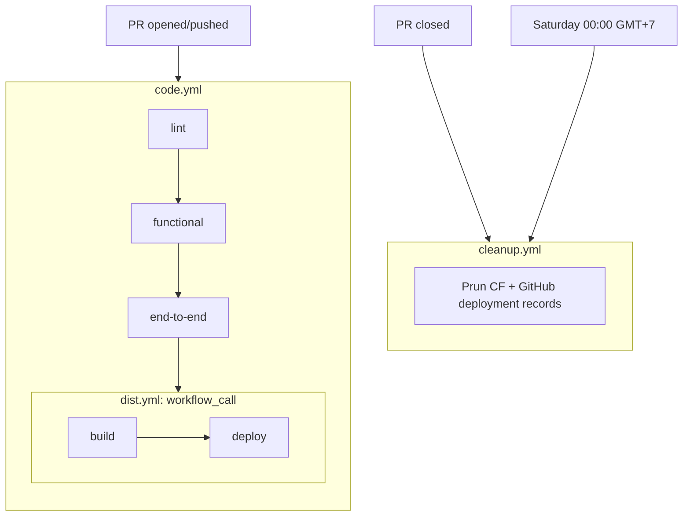

# learn-viteplus

Learning **Vite+** (monorepo tooling) and **Cloudflare** (Pages, Workers, edge compute) — all within free plan boundaries.

A Vue 3 web app + TypeScript library, managed as a Vite+ monorepo.

## Architecture

| Package                  | Path              | Build                         |
| ------------------------ | ----------------- | ----------------------------- |
| `@feryardiant/lvp-web`   | `apps/website/`   | `vp build` → Cloudflare Pages |
| `@feryardiant/lvp-utils` | `packages/utils/` | `vp pack` (tsdown) → `dist/`  |

## CI/CD Pipeline

All three workflows use `pull_request_target` to safely access secrets from fork PRs (unlike `pull_request` which doesn't provide secrets for forks).



| Workflow      | Event                                                       | What it does                                                              |
| ------------- | ----------------------------------------------------------- | ------------------------------------------------------------------------- |
| `code.yml`    | `pull_request_target [opened, synchronize]` + `push [main]` | Lint, functional tests (matrix), e2e tests, then call `dist.yml`          |
| `dist.yml`    | `workflow_call` + `workflow_dispatch`                       | Build website, deploy to CF Pages                                         |
| `cleanup.yml` | `pull_request_target [closed]` + `schedule`                 | Cleanup on PR close; weekly prune stale previews & old production deploys |

## Key Learnings

### `workflow_run` limitations

Initial approach (in [`1ceb2bb`](https://github.com/feryardiant/learn-viteplus/commit/1ceb2bbde7575a013fc511943b4e595a9f65f1a1)) used `workflow_run` to chain workflows sequentially. Two problems (see [#5](https://github.com/feryardiant/learn-viteplus/issues/5)):

- Downstream workflows don't show as PR checks (no PR context)
- They run on the default branch (`main`), not the PR branch

### `pull_request_target` for fork-safe secrets (in [`27f00b3`](https://github.com/feryardiant/learn-viteplus/commit/27f00b3024870a56cb5af1d577cb980811818516))

Switched to `pull_request_target` + explicit `ref: head.sha` checkout. Same security model as `workflow_run` (workflow YAML from base repo, PR code at commit level) but with full PR visibility.

**Tradeoff**: `pull_request_target` runs in the base repo context with secrets — same risk as `workflow_run`, you're trusting that you won't run malicious `run:` steps from the base branch's workflow file.

### `pull_request_target` workflow resolution (in [`03ca80a`](https://github.com/feryardiant/learn-viteplus/commit/03ca80ae58717cf0be67c21a30eb7e330985be95))

`pull_request_target` always resolves workflow files from the **base branch** (`main`), not the PR branch. This means changes to `dist.yml` (or `code.yml`) on a feature branch are invisible to the CI until merged.

```yaml
# code.yml on main triggers for PR events
on: pull_request_target

jobs:
  distribute:
    uses: ./.github/workflows/dist.yml # always resolves from main
```

Unlike reusable workflows from external repos (which support `@ref` pinning), local workflows have no versioning mechanism.

**Workaround for testing during development**: temporarily switch the trigger from `pull_request_target` to `pull_request`. When both the PR and base branch are within the same repository (not a fork), secrets are still available. This lets the CI pick up workflow changes from the feature branch for testing.

```diff
- on: pull_request_target
+ on: pull_request
```

Revert to `pull_request_target` before merging to maintain fork-safe behavior.

### Reusable workflows with `workflow_call` (in [`27f00b3`](https://github.com/feryardiant/learn-viteplus/commit/27f00b3024870a56cb5af1d577cb980811818516))

`dist.yml` is called from `code.yml` with `secrets: inherit`. Also supports `workflow_dispatch` for manual deployments. Branch is resolved via `${{ inputs.branch || github.ref_name }}` — input for `workflow_call`, selected branch for `dispatch`.

### CF Pages API quirks (see [`27420860064`](https://github.com/feryardiant/learn-viteplus/actions/runs/27420860064) and [this comment](https://github.com/feryardiant/learn-viteplus/pull/4#issuecomment-4692087162))

- Deleting an aliased deployment requires `?force=true`
- Deployments are identified by **branch**, not PR number — creates a race if the same branch name is reused for a new PR before cleanup finishes
- A PR can have **multiple** CF Pages deployments over its lifetime (new pushes, re-runs). Cleanup must loop over all matching deployments, not just the latest (`head -1`)

### GitHub Deployments API (see [`27420860064`](https://github.com/feryardiant/learn-viteplus/actions/runs/27420860064) and [this comment](https://github.com/feryardiant/learn-viteplus/pull/4#issuecomment-4692087162))

- Deployments must be marked `inactive` before they can be deleted
- Production pruning: keep only the latest deployment, mark older ones as inactive (not deleted)

### Bash gotchas in GitHub Actions (in [`9002824`](https://github.com/feryardiant/learn-viteplus/commit/900282498cf29291b34a30d3b5021535c54fb8ba))

- Piped `while read` loops run in a subshell — variables set inside them don't persist. Use process substitution (`< <(command)`) instead
- `$GITHUB_STEP_SUMMARY` for markdown workflow summaries

### Dead `||` after `done < <(...)` (in [`39fb9cb`](https://github.com/feryardiant/learn-viteplus/commit/39fb9cbe1d53e20e732d17ff023bc0e0f6ec0316))

A `||` after `done < <(command)` never actually catches command failures:

```bash
# This does NOT catch jq failures:
done < <(jq '...') || { echo "::error::..."; }

# jq's exit code doesn't propagate through process substitution
# Empty results make while exit 0 (not 1), so the handler is dead code
```

Correct pattern — capture output in a variable first, check the exit code:

```bash
DATA=$(jq '...') || {
    echo "::error ::Failed to parse"
    exit 1
}
while read -r ITEM; do ... done <<< "$DATA"
```

### Workflow error annotations (in [`a999f12`](https://github.com/feryardiant/learn-viteplus/commit/a999f12c851328b05287851c8c7ddd85ab9dae1b))

GitHub Actions supports `::error::` and `::warning::` annotations that show up inline on the workflow run page (not just in raw logs).

```bash
command || echo "::error ::Something went wrong"
```

Patterns applied:

- **Critical failures** (`::error::`): API list/delete failures — stop the step with `exit 1`
- **Non-critical failures** (`::warning::`): Mark status as inactive failure — log but continue
- **`set -o pipefail`**: Ensures pipe failures (e.g. `curl | jq`) don't get silently lost
- Replace bare `|| true` with `|| echo "::error::..."` so silence doesn't mask real errors

### Concurrency groups

Per-branch concurrency keys (`cleanup-{branch}`, `Code-{branch}`) serialize runs for the same branch while allowing parallel runs across different branches.

### oxfmt LSP doesn't read config from `vite.config.ts` (in VS Code)

In [`26f38b1`](https://github.com/feryardiant/learn-viteplus/commit/26f38b1d0d428aa1d8f8d648ef916559dda93000) — the oxfmt LSP reads config differently depending on the editor, even though both use the same LSP binary:

| Editor      | Config delivery                                                | Result                                   |
| ----------- | -------------------------------------------------------------- | ---------------------------------------- |
| **Zed**     | `initialization_options` in LSP `initialize` handshake         | ✅ Config loaded correctly               |
| **VS Code** | `workspace/didChangeConfiguration` / `workspace/configuration` | ❌ Config path received but not acted on |

Two root causes:

1. **Extension-side bug** ([oxc-vscode#222](https://github.com/oxc-project/oxc-vscode/issues/222)): The extension sends `fmt.configPath` to the LSP but the LSP's formatter doesn't open/parse the config file. A fix landed in [oxc#21081](https://github.com/oxc-project/oxc/pull/21081) but follow-ups like [oxc#21890](https://github.com/oxc-project/oxc/issues/21890) show `vite.config.ts` still fails LSP deserialization.

2. **`vite.config.ts` import resolution** ([vite-plus#861](https://github.com/voidzero-dev/vite-plus/issues/861), [#930](https://github.com/voidzero-dev/vite-plus/issues/930)): The oxfmt LSP's JS config loader can't resolve `import { defineConfig } from 'vite-plus'`, so parsing the config fails silently and it falls back to defaults (double quotes, semicolons).

**Workaround**: Route non-JS/TS files (YAML, etc.) to dedicated language servers. In `.vscode/settings.json`:

```json
{
  "yaml.format.singleQuote": true,
  "[yaml]": {
    "editor.defaultFormatter": "redhat.vscode-yaml"
  }
}
```

The CLI (`vp fmt`, `vp check --fix`) works correctly because at runtime Vite+ generates a resolved config file that oxfmt can consume directly.

### ANSI escape codes break regex matching in piped output

E2e test `globalSetup` spawns the dev server and waits for `Local: http://localhost:(\d+)` in stdout/stderr. CI failed with "Dev server did not start within 30s" despite the dev server starting successfully.

**Root cause**: The Vite dev server outputs ANSI escape codes (colors, bold) that are interleaved within the matched text:

```
\033[1mLocal\033[22m:   \033[36mhttp://localhost:\033[1m5173\033[22m/
```

The regex `Local:\s+http:\/\/localhost:(\d+)` never matches because escape codes sit between `Local` and `:`, and inside `localhost:5173`.

**Fix**: Strip ANSI codes from the accumulated buffer before matching:

```ts
const ansiPattern = new RegExp(`${String.fromCharCode(27)}\\[[0-9;]*[a-zA-Z]`, 'g')
const stripAnsi = (str: string) => str.replace(ansiPattern, '')

const clean = stripAnsi(output)
const match = clean.match(/Local:\s+http:\/\/localhost:(\d+)/)
```

Note: Using `String.fromCharCode(27)` instead of `\x1B` or `\u001B` in the regex literal avoids the Oxlint `no-control-regex` warning.

**Initial misdiagnosis**: First suspected buffered output splitting — the `onData` handler was checking each individual `data` chunk against the regex. If the "Local:" line was split across chunks, the regex would fail. Accumulating into a buffer was still the right fix, but the actual culprit was ANSI codes, not splitting.

### Process cleanup on error detection

When the dev server outputs an error message (detected via `error:` prefix in output), the original code set `settled = true` but left the process running and the timeout active. The process would eventually exit or the timeout would fire, but the error was silently swallowed.

**Better approach**: Kill the process and let the `exit` handler do the cleanup. The error message is already captured, so the exit handler rejects with the correct message:

```ts
if (errorMatch) {
  errorMessage = errorMatch[1]
  // Kill the process — exit handler will clear timeout and reject
  if (typeof proc.pid === 'number') {
    try {
      process.kill(-proc.pid, 'SIGTERM')
    } catch {}
  }
}
```

### `kill ESRCH` in process teardown

When stopping the dev server, `forceKill` sends `SIGKILL` to the process group after a 5-second fallback timeout. If the process already exited (e.g., crashed or was killed by the earlier `SIGTERM`), `process.kill()` throws `ESRCH` ("No such process").

This is harmless — the `finally` block (or `catch {}`) ensures the promise resolves. But the original `try/finally` pattern surfaced the error in logs. Swapping to `try/catch {}` + unconditional `resolve()` produces the same behavior without noise.

### Functional testing in monorepo CI

When unit and integration tests run together per workspace package, the umbrella term is **functional testing** — as opposed to **e2e testing** which exercises full user-facing flows via Playwright.

The CI pipeline separates these:

| Job          | Scope                                                              |
| ------------ | ------------------------------------------------------------------ |
| `lint`       | `vp check` — runs once                                             |
| `functional` | `vp run ${{ matrix.pkg }}#test` — matrix, parallel                 |
| `end-to-end` | `vp test --project @feryardiant/learn-viteplus` — Playwright smoke |

### Resolving workspace package paths in CI

For monorepo CI jobs that need a package's directory (e.g., for Codecov coverage upload), resolve it dynamically from `package.json` names instead of hardcoding:

```bash
PKG_PATH=$(find apps packages -name "package.json" -not -path "*/node_modules/*" \
  -exec jq -r "select(.name == \"${{ matrix.pkg }}\") | input_filename | split(\"/\")[0:-1] | join(\"/\")" {} \;)
```

This avoids duplication and keeps the matrix portable — adding a new package only requires adding its name to the matrix list.

## Future Direction

- **Workers & Page Functions**: API routes, middleware, server-side logic
- **KV**: Session stores, cache, config
- **D1 / SQL DB**: Structured data storage
- **All kept within Cloudflare's free plan**

## Quick Commands

```bash
vp install       # install deps (bun 1.3.14, node >=22.12)
vp run dev       # start website dev server
vp run ready     # check + test + build all workspaces
vp check         # lint + typecheck (Oxlint + Oxfmt)
vp check --fix   # auto-fix lint/format
vp test          # run tests in current workspace
vp run -r test   # run tests across all workspaces
vp run -r build  # build all workspaces
vp env doctor    # debug setup/runtime issues
```

## License

MIT